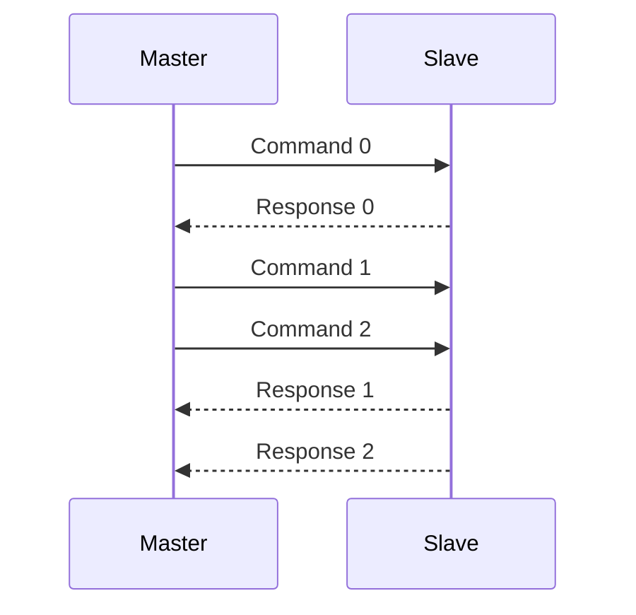
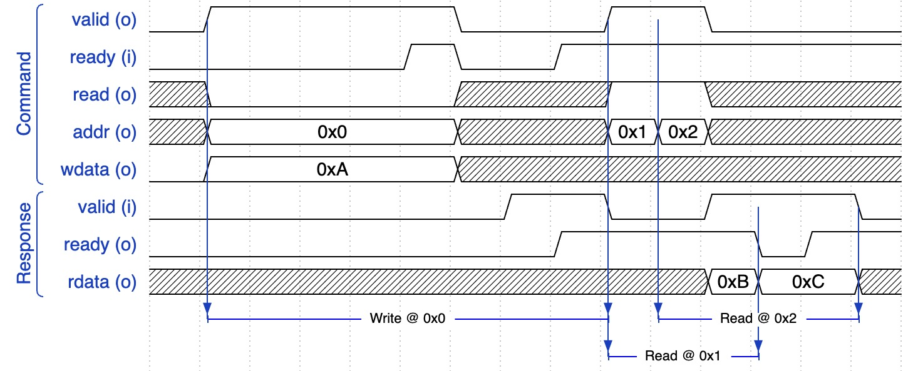

# 🌰 Acorn Bus

Acorn Bus 是 Chipmunk 预置的一款片上总线，它旨在提供一款简单但高效的片上总线的硬件实现。相比 AMBA AXI 等成熟的片上总线协议，Acorn Bus 简化了许多功能，更加易于硬件实现。

Acorn Bus 的读写信号是分离的，读和写分别有一组 Command 通道和 Response 通道。Command 通道用于 Master 向 Slave 发送读或写的请求，Response 通道用于 Slave 向 Master 返回读或写的响应。Command 和 Response 通道都采用 ready-valid 握手协议来解耦，即当且仅当该通道的 ready 和 valid 信号都有效时完成一次传输。

## 信号定义

### Write Command Channel (`wr.cmd`)

| Signal   | Direction | Bit Width      | Description                              |
|----------|-----------|----------------|------------------------------------------|
| `addr`   | Output    | ADDR_WIDTH     | The address to be written.               |
| `data`   | Output    | DATA_WIDTH     | The data to be written.                  |
| `strobe` | Output    | DATA_WIDTH / 8 | The byte mask of `wdata`.                |
| `valid`  | Output    | 1              | The valid signal of the command channel. |
| `ready`  | Input     | 1              | The ready signal of the command channel. |

### Write Response Channel (`wr.rsp`)

| Signal   | Direction | Bit Width | Description                                 |
|----------|-----------|-----------|---------------------------------------------|
| `status` | Output    | 1         | Whether the operation is successfully done. |
| `valid`  | Output    | 1         | The valid signal of the response channel.   |
| `ready`  | Input     | 1         | The ready signal of the response channel.   |

### Read Command Channel (`rd.cmd`)

| Signal  | Direction | Bit Width  | Description                              |
|---------|-----------|------------|------------------------------------------|
| `addr`  | Output    | ADDR_WIDTH | The address to be read.                  |
| `valid` | Output    | 1          | The valid signal of the command channel. |
| `ready` | Input     | 1          | The ready signal of the command channel. |

### Read Response Channel (`rd.rsp`)

| Signal   | Direction | Bit Width  | Description                                 |
|----------|-----------|------------|---------------------------------------------|
| `rdata`  | Output    | DATA_WIDTH | The readout data.                           |
| `status` | Output    | 1          | Whether the operation is successfully done. |
| `valid`  | Output    | 1          | The valid signal of the response channel.   |
| `ready`  | Input     | 1          | The ready signal of the response channel.   |

以上信号方向（Direction）是对于 Master 侧而言的，对于 Slave 侧而言则相反（下同）。

其中，写掩码信号 `wr.cmd.strobe` 用于指示写数据的有效字节，其行为和 AMBA AXI 的 `strb` 信号类似。当且仅当 `strobe` 的某一位为 1 时，对应的 `wr.cmd.data` 的对应字节会被写入。 例如，当 `strobe` 的第 0 bit 为低时，`data` 的最低字节（最低 8 bit）有效；当 `strobe` 的第 1 bit 为高时，`data` 的第 8 ~ 15 位有效，以此类推。

读/写响应状态信号 `wr/rd.rsp.status` 用于指示读/写操作是否成功，其语义和 AMBA AXI 的 `resp` 信号类似。`status` 为 0 时表示操作成功。

### 传输时序

如下图所示，Master 先后完成了：
1. 写入数据 `0xA` 到地址 `0x0`；
2. 读取地址 `0x1` 的数据，返回 `0xB`；
3. 读取地址 `0x2` 的数据，返回 `0xC`。

为了简洁，图中未绘出 `wmask` 信号和 `status` 信号。

传输过程中一些关键的要点：
- Command 和 Response 通道均要求发起侧不撤回（irrevocable），即 `valid` 一旦生效直到 `ready` 生效前其他信号不可发生改变，`valid` 也不能拉低。
- 和其他的 ready-valid 握手协议一样，Command 和 Response 通道的 `valid` 不能依赖于 `ready`，以避免组合逻辑环。
- 在没有从 Command 通道收到有效请求时，Slave 不可以发起 Response 通道的传输请求，即不得拉高 `valid`。

## 在 Chipmunk 中的实现

Acorn Bus 的 IO 定义：`chipmunk.acorn.AcornIO`

此外，Chipmunk 还提供了 Acorn Bus 与 AXI、AXI-Lite 等其他总线的转换桥接模块。

## 与 AMBA AXI 总线的差异

Acorn Bus 与 AMBA AXI 相比，在功能上有所简化。主要区别如下：
- Acorn Bus 和 AXI 一样，同样实现了读写分离，但 AXI 的写数据和写地址是独立传输的，而 Acorn Bus 的写数据和其他写控制信号是一起传输的；
- Acorn Bus 支持多周期连续传输，但 Command 通道的每个有效握手周期 Master 都需要给出一个地址。
- Acorn Bus 不支持乱序返回，即 Slave 必须按照 Master 的请求顺序返回数据。
- Acorn Bus 和 AXI 一样，都支持 Write Byte Mask、Outstanding Transaction 等特性。

简单（但不准确）地说，用户可以将 Acorn Bus 当作一个 AW 和 W 通道合并且缺少 `id`、`burst`、`prot` 等控制信号（和他们对应的高级特性）的 AXI 总线。
