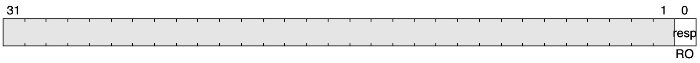
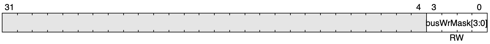

# 🔍 SPI Debugger

SPI Debugger 允许用户通过 SPI 接口访问片上总线，从而调试 SoC 的各种外设。

它的输入侧端口是一组 SPI 的 Slave 接口，输入侧端口是一组 Acorn Dp Bus 的 Master 接口，后者可以容易地转换成 AXI 等接口连接到SoC 总线上。

## Register Map

SPI Debugger 内部寄存器定义如下：

### BUS_ADDR_H (0x00)

该寄存器仅当配置选项 `busAddrWidth` > 32 时才会存在，且只有其低 (`busAddrWidth`-32) bit 可被访问。

其值与寄存器 `BUS_ADDR_L` 组合在一起作为总线访问地址（`wr/rd.cmd.bits.addr`）。

图中的例子是 `busAddrWidth` = 45 时的情况。

### `BUS_ADDR_L` (0x01)

当配置选项 `busAddrWidth` > 32 时，寄存器 `BUS_ADDR_L` 与该寄存器的值组合在一起作为总线访问地址；否则，该寄存器的低 `busAddrWidth` bit 作为总线访问地址（`wr/rd.cmd.bits.addr`）。

### `BUS_WR_RESP` (`0x02`)

读取该寄存器，其最低 bit 表示上一次总线写操作是否成功（`wr.resp.bits.status`），0 表示成功，1 表示有错误发生。

写入该寄存器（无论写 1 或者 0），会发起一次总线写操作。

### `BUS_RD_RESP` (`0x03`)

读取该寄存器，其最低 bit 表示上一次总线读操作是否成功（`rd.resp.bits.status`），0 表示成功，1 表示有错误发生。

写入该寄存器（无论写 1 或者 0），会发起一次总线读操作。

### `BUS_WR_DATA` (`0x04`)

该寄存器的值作为总线写操作的数据（`wr.cmd.bits.wdata`）。

### `BUS_RD_DATA` (`0x05`)

读取该寄存器，将返回上一次总线读操作的返回数据（`rd.resp.bits.rdata`）。

### `BUS_WR_MASK` (`0x06`)

该寄存器的值作为总线写操作的数据掩码（`wr.cmd.bits.wmask`）。

### `TEST` (`0x3F`)

该寄存器用于 SPI 的 Loopback 读写测试，其值对总线不会有任何影响。

## SPI Command Sequences

要通过 SPI Debugger 访问其内部寄存器和总线侧 Acorn Bus 接口，Master 侧的 SPI Controller 应当：
1. 拉低 SSN 启动 SPI 传输；
2. 发送 1 byte 的 Command；
3. 根据不同的 Command，发送或接收若干字节的数据；
4. 拉高 SSN 结束 SPI 传输。

SPI Debugger 支持的 Command 包括：
- `REG_WR` (`0x00xx_xxxx`)：写内部寄存器，低 6 bit 用于区分寄存器；
- `REG_RD` (`0x01xx_xxxx`)：读内部寄存器，低 6 bit 用于区分寄存器；
- `BUS_WR` (`0b1000_0000`)：写总线；
- `BUS_RD` (`0b1100_0000`)：读总线；
- `NOP` (`0b1xxx_xxxx`)：空操作。

### `REG_WR`

其传输序列为：`Command` (8b) + `WrData` (32b)

在 `WrData` 阶段，Master 需要将 32 bit 的待写数据通过 MOSI 线发送给 SPI Debugger。SPI Debugger 在接收到 32 bit 数据后，将其写入对应的寄存器。

### `REG_RD`

其传输序列为：`Command` (8b) + `RdData` (32b)

在 `WrData` 阶段，SPI Debugger 将 32 bit 的寄存器读出数据通过 MISO 线发送给 SPI Master。

### `BUS_WR`

其传输序列为：`Command` (8b) + `Addr` (32b) + `WrData` (32b)

在 `Addr` 和 `WrData` 阶段，Master 需要分别将 32 bit 的待写地址和待写数据发送给 SPI Debugger。SPI Debugger 会将它们填入寄存器 `BUS_ADDR_L` 和 `BUS_WR_DATA`，然后立刻发起一次总线写操作。

### `BUS_RD`

其传输序列为：`Command` (8b) + `Addr` (32b) + `Dummy` (8b) + `RdData` (32b)

在 `Addr` 阶段，Master 需要将 32 bit 的待读地址发送给 SPI Debugger。SPI Debugger 会将其填入寄存器 `BUS_ADDR_L`，然后立刻发起一次总线读操作。在 `RdData` 阶段，SPI Debugger 将总线返回的读出数据通过 MISO 线发送给 SPI Master。

### `NOP`

其传输序列为：`Command` (8b)

空操作，什么都不会发生。

## Common Issues

1. 即使需要连续多次访问，期间也必须先拉高 SSN 结束当前 SPI 传输，再拉低 SSN 开始下一次传输；
2. 在拉高 SSN 结束当前 SPI 传输前，请务必确定已经完成了整个操作序列所需的数据传输（即等待足够的时间）；
3. SPI 的传输速率不宜过高，原则上 SCK 的频率应当比系统时钟至少低四倍。
