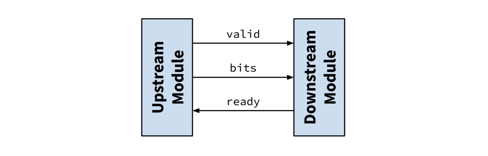
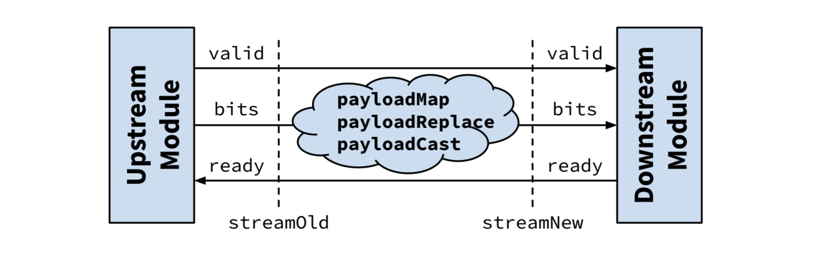

# 🐿️ DecoupledIO 增强版之 StreamIO

在数字电路设计中，我们经常使用 Ready/Valid 握手协议来解耦数据流，Chisel 提供了 `DecoupledIO` 用以实现这一协议。然而，`DecoupledIO` 仅是一个预置的 `Bundle`，缺少与之配套的一系列常用组件（例如寄存器切片、Mux/Demux 等），此外它也未能搭配 `chipmunk.IsMasterSlave`。`chipmunk` 为 `DecoupledIO` 提供了一个“威力加强版”的 Ready/Valid 握手协议——`chipmunk.StreamIO`。

## Ready/Valid 握手协议



Ready/Valid 握手协议由三部分信号组成：
- `valid`：表示数据有效，即上游数据已经准备好，可以被消费；
- `ready`：表示数据可被消费，即下游已经准备好接收数据；
- `bits`（即 `payload`）：表示数据本身。

其中，`valid` 和 `bits` 信号由上游产生，`ready` 信号由下游产生。当 `valid` 和 `ready` 信号同时有效时，`bits` 信号被传递，即数据被消费。利用这一协议，我们可以将数据流的生产和消费解耦：上游模块只需要在准备好数据后将 `valid` 和 `bits` 信号置为有效，而无需关心下游模块内部的状态；而下游模块只需要在准备好接收数据后将 `ready` 信号置为有效，当 `valid` 和 `ready` 信号同时有效时取走 `bits` 数据。通过使用 Ready/Valid 握手协议，开发者可以将注意力集中在自己负责的电路逻辑上，而无需过度关心其他模块的内部实现，从而提高开发效率。

需要注意的是，为了避免组合逻辑环路，我们要求 `valid`（及 `bits`）和 `ready` 信号不能同时依赖对方的当前状态。因此，在 Chipmunk（和其他绝大多数数字电路设计）中，我们约定 `valid` 不允许依赖于 `ready` 的当前状态，即上游模块不允许根据下游模块此刻是否 `ready` 来决定当前周期是否将 `valid` 置为有效。简单地说，用于 `valid` 产生的组合逻辑表达式中不能出现下游模块的 `ready` 信号。

关于 Ready/Valid 握手协议的更多细节，网上已经有了丰富的材料可以参考，这里不再赘述。

## 关于 `StreamIO`

### Why?

Chisel 提供了 `DecoupledIO` 和 `IrrevocableIO` 两个 Ready/Valid 握手协议的 `Bundle` 实现，它们都继承自 `chisel3.ReadyValidIO`。Chisel 并未为这两个接口提供太多 API，基本上只有：
- `def fire: Bool = ready && valid`，表示当前周期是否发生了数据传输；
- `class Queue`，以 `ReadyValidIO` 为接口的同步 FIFO；
- `def map[T](f: T => T2): T`，用于对 `bits` 进行变换。

`IrrevocableIO` 其实在实现上 `DecoupledIO` 并无区别，只是约定它的 `bits` 在 `valid` 有效但 `ready` 无效时不会改变，即数据不可撤回。两者的实际差别有赖于具体模块中的电路实现。

很显然，上述 API 不足以应付实际的设计需求。

Chipmunk 在 `chisel3.ReadyValidIO` 的基础上提供了 `chipmunk.StreamIO`，它继承自 `chisel3.ReadyValidIO`，并提供了一系列常用的 API 和特性，包括：
- 一系列类似`fire` 的语法糖，展现数据传输的不同状态；
- 符号化的连接方法，类似 `a >> b >-> c`，可以很容易地看出数据的流向；
- 针对 `bits` 的一系列操作，包括 Map、Cast 等；
- 一系列常用的组件，包括寄存器切片（Register Slice）、Fork/Join、Mux/Demux 等。

`StreamIO` 在实现上参考了 [SpinalHDL](https://spinalhdl.github.io/SpinalDoc-RTD/master/SpinalHDL/Libraries/stream.html) 的 `Stream` 的 API 设计，熟悉 SpinalHDL 的同学应该会有一丝熟悉的感觉。

### Usage

#### StreamIO 例化

- 创建一个 `StreamIO`，其 `payload` 类型为 `UInt`：
```scala
val myStream = Wire(Stream(UInt(32.W)))
```

- 创建一个 `StreamIO`，其 `payload` 类型和另一个 `DecoupledIO` 的 `bits` 一致：
```scala
val myDecoupled = Wire(Decoupled(UInt(32.W)))
val myStream = Wire(Stream(myDecoupled))
```
请注意这里 `myStream` 不会与 `myDecoupled` 有任何电路连接（比如共享 `bits`），而是会创建一个新的 `UInt` 作为 `payload`。

- 创建一个空的 `StreamIO`（即其 `payload` 类型为 `EmptyBundle`）：
```scala
val myStream = Wire(Stream.empty)
```
空的 `StreamIO` 一般用于声明时没有确定 `payload` 类型的情况，后续可以搭配 `payloadReplace` 等 API 赋予具体的 `payload`。

#### 流控与状态指示

`StreamIO` 提供以下状态指示方法，它们的返回类型均为 `Bool`：

| 语法             | 描述                                       |
|:---------------|:-----------------------------------------|
| `x.fire`       | 当前周期正在进行数据传输，即 `ready && valid`          |
| `x.isPending`  | 上游数据已经就绪，但下游未能准备好接收，即 `!ready && valid`  |
| `x.isStarving` | 下游已准备好接收数据，但上游没有发起传输，即 `ready && !valid` |

`StreamIO` 也提供下列方法对数据流进行流控，它们会返回一个新的 `StreamIO`：

| 语法                     | 描述                                                              |
|:-----------------------|:----------------------------------------------------------------|
| `x.haltWhen(cond)`     | 当 `cond` 为 `True` 时，数据传输会被阻断，即上下游模块均无法完成握手。                     |
| `x.continueWhen(cond)` | 相当于 `x.haltWhen(!cond)`                                         |
| `x.throwWhen(cond)`    | 当 `cond` 为 `True` 时，数据传输会被丢弃，即上游模块发起的数据传输都会成功握手，但下游模块不会收到相应的数据。 |
| `x.takeWhen(cond)`     | 相当于 `x.throwWhen(!cond)`                                        |

#### Payload 变换



`StreamIO` 允许对 `payload` 直接进行一系列变换，包括：

```scala
def payloadMap[T2 <: Data](f: T => T2): StreamIO[T2]
def payloadReplace[T2 <: Data](p: T2): StreamIO[T2]
def payloadCast[T2 <: Data](gen: T2, checkWidth: Boolean = false): StreamIO[T2]
```

上述方法会返回一个新的 `StreamIO`，其 `payload` 会变成变换后、类型为 `T2` 的新信号，同时其 `ready` 和 `valid` 信号会连接到当前 `StreamIO` 的 `ready` 和 `valid` 信号。

- `payloadMap` 可以将函数 `f` 作用于 `payload`，比如：
```scala
val streamOld = Wire(Stream(UInt(32.W)))
val StreamNew = streamOld.payloadMap(_ + 1.U)
```

- `payloadReplace` 会将 `payload` 替换为 `p`，相当于 `payloadMap(_ => p)`，比如：
```scala
val streamOld = Wire(Stream(UInt(32.W)))
val anotherBool = Wire(Bool())
val StreamNew = streamOld.payloadReplace(anotherBool)
```

- `payloadCast` 会对 `payload` 进行强制类型转换，相当于 `payloadMap(_.asTypeOf(gen))`，比如：
```scala
val streamOld = Wire(Stream(UInt(32.W)))
val StreamNew = streamOld.payloadCast(SInt(32.W), checkWidth = true)
```
其中参数 `checkWidth = true` 允许检查类型转换前后的位宽是否一致，如果不一致抛出异常。该参数默认为 `false`，即不会检查位宽，如果位宽不一致会自动截断或扩展。

#### 寄存器切片（Register Slice）

为 `StreamIO` 插入寄存器切片以改善时序，是一个常见的需求。然而，这实现起来非常繁琐且易错。显然，我们不能直接在 `StreamIO` 的 `ready`/`valid`/`bits` 路径上贸然插入寄存器切片。`valid` 和 `ready` 分别代表当前周期上游模块和下游模块的状态，在它们的传播通路上引入寄存器会导致状态延后若干周期才会传播到对侧。这会导致上下游模块无法在正确的时机完成握手，可能会引起数据丢失或吞吐下降。

根据寄存器插入位置不同，`StreamIO` 提供：

- `pipeForward`：前向寄存器切片，切断从上游模块到下游模块的 `valid` 和 `bits` 通路的组合逻辑路径；
```scala
val streamNew = streamOld.pipeForward()
```
它在性能上不会引入吞吐下降（虽然会增加 1 周期延时），在面积上代价是 N + 1 个寄存器（N 是 `bits` 位宽）以及少量组合逻辑。
- `pipeBackward`：后向寄存器切片，切断从下游模块到上游模块的 `ready` 通路的组合逻辑路径。
```scala
val streamNew = streamOld.pipeBackward()
```
它在性能上不会引入额外的延时和吞吐下降，在面积上代价是 N + 1 个寄存器（N 是 `bits` 位宽）、N 个 2:1 MUX 以及少量组合逻辑。
- `pipeAll`：双向寄存器切片，同时切断 `valid`、`bits`、`ready` 通路的组合逻辑路径。
```scala
val streamNew = streamOld.pipeAll()
```
相当于 `streamOld.pipeForward().pipeBackward()`，因此它会引入 2N + 2 个寄存器（N 是 `bits` 位宽）、N 个 2:1 MUX 以及少量组合逻辑。
- `pipeSimple`：双向寄存器切片，同时切断 `valid`、`bits`、`ready` 通路的组合逻辑路径。
```scala
val streamNew = streamOld.pipeSimple()
```
它至多每隔一个周期握手一次，因此会引起最高可达一半的吞吐损失，但面积上只需要 N + 2 个寄存器以及少量的组合逻辑。与 `pipeAll` 相比，它的面积代价更小，但会引入额外的性能损失。
- `pipeValid`：仅切断 `valid` 通路的组合逻辑路径。
```scala
val streamNew = streamOld.pipeValid()
```
面积上仅需要 1 个寄存器和少量组合逻辑。
- `pipPassThrough`：什么都不做，返回当前的 `StreamIO`。
```scala
val streamNew = streamOld.pipPassThrough()
```

#### 符号化连接

`StreamIO` 提供了一系列方法用于连接其他 `StreamIO`：

| 语法                   | 描述                                                          |
|:---------------------|:------------------------------------------------------------|
| `x.connectFrom(y)`   | 用 `y` 驱动 `x`，即 `y` 作为 `x` 的上游进行连接 `ready`、`valid`、`bits` 信号 |
| `x.handshakeFrom(y)` | 和 `connectFrom` 类似，但只连接 `ready`、`valid` 信号，不连接 `bits` 信号    |
| `x << y`             | 相当于 `x.connectFrom(y)`，返回 `y`                               |
| `x >> y`             | 相当于 `y.connectFrom(x)`，返回 `y`                               |
| `x <-< y`            | 相当于 `x << y.pipeForward()`，返回 `y`                           |
| `x >-> y`            | 相当于 `x.pipeForward() >> y`，返回 `y`                           |
| `x <\|< y`           | 相当于 `x << y.pipeBackward()`，返回 `y`                          |
| `x >\|> y`           | 相当于 `x.pipeBackward() >> y`，返回 `y`                          |
| `x <+< y`            | 相当于 `x << y.pipeAll()`，返回 `y`                               |
| `x >+> y`            | 相当于 `x.pipeAll() >> y`，返回 `y`                               |

借助 `<<`、`>>` 等流操作符，我们可以实现可读性较强的 `StreamIO` 连接甚至级连，比如：
```scala
val s1 = Stream(UInt(8.W))
s1 <-< uAnotherModule.io.outStream
s1.haltWhen(somethingEnable) >> uSomeModule.io.inStream
```

## 配套组件

Chipmunk 包括了一系列 `StreamIO` 的配套组件。

### StreamFork/StreamJoin

StreamFork 可以将一个上游 `StreamIO` 分叉成多个下游 `StreamIO`，每个下游 `StreamIO` 会分别完成仅一次握手，上游 `StreamIO` 会在所有下游 `StreamIO` 完成握手后才完成握手。为了提高性能，每个下游 `StreamIO` 是否握手是独立进行的，当它 `ready` 有效时即完成握手，而不需要等到所有下游 `StreamIO` 的 `ready` 都有效。

StreamJoin 可以将多个上游 `StreamIO` 合并成一个下游 `StreamIO`，当且仅当所有上游 `StreamIO` 的 `valid` 都有效时，才会发生握手。

在 `object StreamFork`/`object StreamJoin` 中，Chipmunk 提供了多个接口略有差别的方法。用户可以阅读代码中的注释，根据自己的需求选择合适的方法。

### StreamMux/Demux/...

TODO
