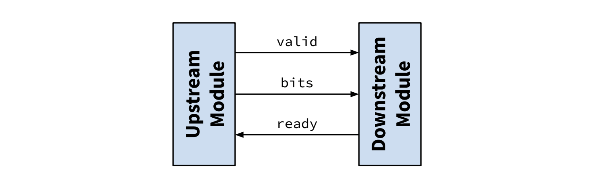
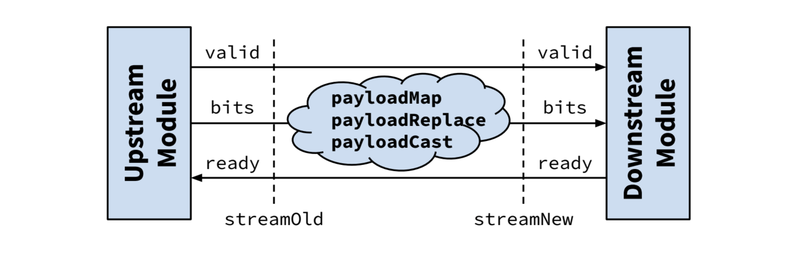

# 🐿️ DecoupledIO 增强版之 StreamIO

在数字电路设计中，我们经常使用 Ready/Valid 握手协议来解耦数据流，Chisel 提供了 `DecoupledIO` 用以实现这一协议。然而，`DecoupledIO` 仅是一个预置的 `Bundle`，缺少与之配套的一系列常用组件（例如寄存器切片、Mux/Demux 等），此外它也未能搭配 `chipmunk.IsMasterSlave`。`chipmunk` 为 `DecoupledIO` 提供了一个“威力加强版”的 Ready/Valid 握手协议——`chipmunk.stream.StreamIO`。

使用 `import chipmunk.stream.*`，角色包装用 `import chipmunk.*`。以下硬件片段位于模块内，并导入 `chisel3.*` / `chisel3.util.*`。`Stream(...)` 和 `Flow(...)` 工厂创建的是未绑定类型，需放入 IO/Wire/Reg；`from` 工厂则创建已连接的 Wire。

## Ready/Valid 握手协议



Ready/Valid 握手协议由三部分信号组成：

- `valid`：表示数据有效，即上游数据已经准备好，可以被消费；
- `ready`：表示数据可被消费，即下游已经准备好接收数据；
- `bits`（即 `payload`）：表示数据本身。

`StreamIO` 要求生产者在 `valid && !ready` 时保持 `valid` 和 `bits`，直到事务完成握手。复位或明确约定的 flush 可以取消事务，但需要与连接的模块协调。Chisel 的 `DecoupledIO` 本身没有这一稳定性保证；`Stream.from` 和 `toStream` 只负责接线，不会增加缓冲或自动实现该保证。

其中，`valid` 和 `bits` 信号由上游产生，`ready` 信号由下游产生。当 `valid` 和 `ready` 信号同时有效时，`bits` 信号被传递，即数据被消费。利用这一协议，我们可以将数据流的生产和消费解耦：上游模块只需要在准备好数据后将 `valid` 和 `bits` 信号置为有效，而无需关心下游模块内部的状态；而下游模块只需要在准备好接收数据后将 `ready` 信号置为有效，当 `valid` 和 `ready` 信号同时有效时取走 `bits` 数据。通过使用 Ready/Valid 握手协议，开发者可以将注意力集中在自己负责的电路逻辑上，而无需过度关心其他模块的内部实现，从而提高开发效率。

需要注意的是，为了避免组合逻辑环路，我们要求 `valid`（及 `bits`）和 `ready` 信号不能同时依赖对方的当前状态。因此，在 Chipmunk（和其他绝大多数数字电路设计）中，我们约定 `valid` 不允许依赖于 `ready` 的当前状态，即上游模块不允许根据下游模块此刻是否 `ready` 来决定当前周期是否将 `valid` 置为有效。简单地说，用于 `valid` 产生的组合逻辑表达式中不能出现下游模块的 `ready` 信号。

关于 Ready/Valid 握手协议的更多细节，网上已经有了丰富的材料可以参考，这里不再赘述。

## 关于 `StreamIO`

### Why?

Chisel 提供了 `DecoupledIO` 和 `IrrevocableIO` 两个 Ready/Valid 握手协议的 `Bundle` 实现，它们都继承自 `chisel3.util.ReadyValidIO`。Chisel 并未为这两个接口提供太多 API，基本上只有：

- `def fire: Bool = ready && valid`，表示当前周期是否发生了数据传输；
- `class Queue`，以 `ReadyValidIO` 为接口的同步 FIFO；
- `map(f)`，用于变换 `bits`；Chipmunk 的重载保留 `StreamIO` 返回类型。

`IrrevocableIO` 其实在实现上 `DecoupledIO` 并无区别，只是约定它的 `bits` 在 `valid` 有效但 `ready` 无效时不会改变，即数据不可撤回。两者的实际差别有赖于具体模块中的电路实现。

很显然，上述 API 不足以应付实际的设计需求。

Chipmunk 提供的 `chipmunk.stream.StreamIO` 继承自 `chisel3.util.DecoupledIO`，并提供了一系列常用的 API 和特性，包括：

- 一系列类似`fire` 的语法糖，展现数据传输的不同状态；
- 符号化的连接方法，类似 `a >> b >-> c`，可以很容易地看出数据的流向；
- 针对 `bits` 的一系列操作，包括 Map、Cast 等；
- 一系列常用的组件，包括寄存器切片（Register Slice）、Fork/Join、Mux/Demux 等。

`StreamIO` 在实现上参考了 [SpinalHDL](https://spinalhdl.github.io/SpinalDoc-RTD/master/SpinalHDL/Libraries/stream.html) 的 `Stream` 的 API 设计，熟悉 SpinalHDL 的同学应该会有一丝熟悉的感觉。

### Usage

#### StreamIO 例化

- 创建一个 `StreamIO`，其 `payload` 类型为 `UInt`：
```scala
val myStream = Wire(Stream(UInt(32.W)))
```

- 创建一个 `StreamIO`，其 `payload` 类型和另一个 `DecoupledIO` 的 `bits` 一致：
```scala
val myDecoupled = Wire(Decoupled(UInt(32.W)))
val myStream = Wire(Stream.like(myDecoupled))
```
请注意这里 `myStream` 不会与 `myDecoupled` 有任何电路连接（比如共享 `bits`），而是会创建一个新的 `UInt` 作为 `payload`。

如果需要连接现有接口，可以使用 `Stream.from(myDecoupled)` 或 `myDecoupled.toStream`。其生产者必须已经遵守上述稳定性约定。

- 创建一个空的 `StreamIO`（即其 `payload` 类型为 `EmptyBundle`）：
```scala
val myStream = Wire(Stream.empty)
```
空的 `StreamIO` 传递不带 payload 的事件 token。`payloadReplace` 可以派生具有新 payload 类型的 Stream，但不会更改原接口的静态类型。

#### 流控与状态指示

`StreamIO` 提供以下状态指示方法，它们的返回类型均为 `Bool`：

| 语法             | 描述                                       |
|:---------------|:-----------------------------------------|
| `x.fire`       | 当前周期正在进行数据传输，即 `ready && valid`          |
| `x.isPending`  | 上游数据已经就绪，但下游未能准备好接收，即 `!ready && valid`  |
| `x.isStarving` | 下游已准备好接收数据，但上游没有发起传输，即 `ready && !valid` |

`StreamIO` 也提供下列方法对数据流进行流控，它们会返回一个新的 `StreamIO`：

| 语法                     | 描述                                                              |
|:-----------------------|:----------------------------------------------------------------|
| `x.haltWhen(cond)`     | 当 `cond` 为 `True` 时，数据传输会被阻断，即上下游模块均无法完成握手。                     |
| `x.continueWhen(cond)` | 相当于 `x.haltWhen(!cond)`                                         |
| `x.throwWhen(cond)`    | 当 `cond` 为 `True` 时，数据传输会被丢弃，即上游模块发起的数据传输都会成功握手，但下游模块不会收到相应的数据。 |
| `x.takeWhen(cond)`     | 相当于 `x.throwWhen(!cond)`                                        |

上述条件没有内部锁存。在输出 `valid && !ready` 期间，`cond` 必须保持不变，否则可能撤回已经提供的事务。

#### Payload 变换



`StreamIO` 允许对 `payload` 直接进行一系列变换，包括：

```scala
def payloadMap[T2 <: Data](f: T => T2): StreamIO[T2]
def payloadReplace[T2 <: Data](p: T2): StreamIO[T2]
def payloadCast[T2 <: Data](gen: T2, checkWidth: Boolean = false): StreamIO[T2]
```

上述方法会返回一个新的 `StreamIO`，其 `payload` 为变换后的硬件信号，握手时序不变。回调只在 elaboration 时执行一次，返回值必须是硬件；替换/映射后的 payload 在输出等待期间也必须保持稳定。

- `payloadMap` 可以将函数 `f` 作用于 `payload`，比如：
```scala
val streamOld = Wire(Stream(UInt(32.W)))
val streamNew = streamOld.payloadMap(_ + 1.U)
```

- `payloadReplace` 会将 `payload` 替换为 `p`，相当于 `payloadMap(_ => p)`，比如：
```scala
val streamOld = Wire(Stream(UInt(32.W)))
val anotherBool = Wire(Bool())
val streamNew = streamOld.payloadReplace(anotherBool)
```

- `payloadCast` 会对 `payload` 进行强制类型转换，相当于 `payloadMap(_.asTypeOf(gen))`，比如：
```scala
val streamOld = Wire(Stream(UInt(32.W)))
val streamNew = streamOld.payloadCast(SInt(32.W), checkWidth = true)
```
其中参数 `checkWidth = true` 允许检查类型转换前后的位宽是否一致，如果不一致抛出异常。该参数默认为 `false`，即不会检查位宽，如果位宽不一致会自动截断或扩展。

#### 寄存器切片（Register Slice）

为 `StreamIO` 插入寄存器切片以改善时序，是一个常见的需求。然而，这实现起来非常繁琐且易错。显然，我们不能直接在 `StreamIO` 的 `ready`/`valid`/`bits` 路径上贸然插入寄存器切片。`valid` 和 `ready` 分别代表当前周期上游模块和下游模块的状态，在它们的传播通路上引入寄存器会导致状态延后若干周期才会传播到对侧。这会导致上下游模块无法在正确的时机完成握手，可能会引起数据丢失或吞吐下降。

根据寄存器插入位置不同，`StreamIO` 提供：

- `pipeForward`：前向寄存器切片，切断从上游模块到下游模块的 `valid` 和 `bits` 通路的组合逻辑路径；
```scala
val streamNew = streamOld.pipeForward()
```
最小延迟一拍，最高每拍传输一次，使用 N + 1 个寄存器位（N 是 payload 位宽）。默认 `bubbleCollapse=true`，空缓冲可在输出 ready 为低时接收输入；设为 false 时，输入 ready 跟随输出 ready，消费者必须能够主动提供 ready。

- `pipeBackward`：后向寄存器切片，切断从下游模块到上游模块的 `ready` 通路的组合逻辑路径。
```scala
val streamNew = streamOld.pipeBackward()
```
最小延迟零拍，最高每拍传输一次，使用 N + 1 个寄存器位以及 N 位 2:1 MUX。缓存事务排出那一拍，输入仍保持阻塞；发生背压时可增加延迟。

- `pipeAll`：双向寄存器切片，同时切断 `valid`、`bits`、`ready` 通路的组合逻辑路径。
```scala
val streamNew = streamOld.pipeAll()
```
相当于 `streamOld.pipeForward().pipeBackward()`，因此它会引入 2N + 2 个寄存器（N 是 `bits` 位宽）、N 个 2:1 MUX 以及少量组合逻辑。

- `pipeSimple`：双向寄存器切片，同时切断 `valid`、`bits`、`ready` 通路的组合逻辑路径。
```scala
val streamNew = streamOld.pipeSimple()
```
它至多每隔一个周期握手一次，因此会引起最高可达一半的吞吐损失，但面积上只需要 N + 1 个寄存器位以及少量的组合逻辑。与 `pipeAll` 相比，它的面积代价更小，但会引入额外的性能损失。

- `pipeValid`：仅切断 `valid` 通路的组合逻辑路径。
```scala
val streamNew = streamOld.pipeValid()
```
输出 valid 在首次观察到输入 valid 后一拍置位；输入和输出在同一拍握手，最高每两拍一次。仅使用一个 valid 寄存器，不保存 payload，因此依赖输入生产者保持事务。

- `pipePassThrough`：什么都不做，返回当前的 `StreamIO`。
```scala
val streamNew = streamOld.pipePassThrough()
```

#### 符号化连接

`StreamIO` 提供了一系列方法用于连接其他 `StreamIO`：

| 语法                   | 描述                                                          |
|:---------------------|:------------------------------------------------------------|
| `x.connectFrom(y)`   | 用 `y` 驱动 `x`，即 `y` 作为 `x` 的上游进行连接 `ready`、`valid`、`bits` 信号 |
| `x.handshakeFrom(y)` | 和 `connectFrom` 类似，但只连接 `ready`、`valid` 信号，不连接 `bits` 信号    |
| `x << y`             | 相当于 `x.connectFrom(y)`，返回 `y`                               |
| `x >> y`             | 相当于 `y.connectFrom(x)`，返回 `y`                               |
| `x <-< y`            | 相当于 `x << y.pipeForward()`，返回 `y`                           |
| `x >-> y`            | 相当于 `x.pipeForward() >> y`，返回 `y`                           |
| `x <\|< y`           | 相当于 `x << y.pipeBackward()`，返回 `y`                          |
| `x >\|> y`           | 相当于 `x.pipeBackward() >> y`，返回 `y`                          |
| `x <+< y`            | 相当于 `x << y.pipeAll()`，返回 `y`                               |
| `x >+> y`            | 相当于 `x.pipeAll() >> y`，返回 `y`                               |

借助 `<<`、`>>` 等流操作符，我们可以实现可读性较强的 `StreamIO` 连接甚至级连，比如：
```scala
val s1 = Wire(Stream(UInt(8.W)))
s1 <-< uAnotherModule.io.outStream
s1.haltWhen(somethingEnable) >> uSomeModule.io.inStream
```

## 配套组件

Chipmunk 包括了一系列 `StreamIO` 的配套组件。

### StreamFork/StreamJoin

StreamFork 可以将一个上游 `StreamIO` 分叉成多个下游 `StreamIO`，每个下游 `StreamIO` 会分别完成仅一次握手，上游 `StreamIO` 会在所有下游 `StreamIO` 完成握手后才完成握手。为了提高性能，每个下游 `StreamIO` 是否握手是独立进行的，当它 `ready` 有效时即完成握手，而不需要等到所有下游 `StreamIO` 的 `ready` 都有效。

StreamJoin 可以将多个上游 `StreamIO` 合并成一个下游 `StreamIO`，所有上游 `StreamIO` 的 `valid` 都有效，且下游 `ready` 有效时，各输入与输出同时握手。

Fork 不保存 payload，输入生产者必须保持当前事务，直到所有分支接收完毕。它保证每个输出分别接收一次，并不保证所有输出在同一周期接收。若希望上游先握手、后续再逐步分发，可以在 Fork 前增加 Queue。

```scala
val copies = StreamFork.duplicate(input, 3)
val elements = StreamFork.vecSplit(vectorInput)
val handshakeOnly = StreamFork.withoutPayload(input, 2)
```

`vecSplit` 同时支持 `Vec` 和 `MixedVec`；前者返回 `Vec`，后者返回保留各元素类型及位宽的 `IndexedSeq`。`vecMap` 可以先用一个 elaboration 回调生成 `MixedVec`，再拆分。

Join 按输入事务的位置配对，不检查业务上的事务 ID，也不保存早到的 payload。`withoutPayload` 只合并握手；`vecMerge` 将同类型 payload 按输入顺序合成 `Vec`；`mixedVecMerge` 将不同类型或位宽的 payload 合成 `MixedVec`。

```scala
val words = StreamJoin.vecMerge(Seq(a, b, c))
val mixed = StreamJoin.mixedVecMerge(address, data)

val command = StreamJoin.map(address, data) { (addr, value) =>
  val result = Wire(new WriteCommand)
  result.addr := addr
  result.data := value
  result
}
```

`map` 的回调只在 elaboration 时执行一次，返回硬件 payload；输入同时握手，输出等待期间保持稳定。Fork 和 Join 都允许一个端口，拒绝零端口。

`FlowFork` 提供对应的 `duplicate`、`withoutPayload`、`vecSplit` 和 `vecMap`，但 Flow 无背压，每个输出都必须接收每一个有效周期。

### StreamMux/StreamDemux

Mux 从多个输入中选择一个；Demux 把输入送到一个输出。两者都不保存 payload，支持单端口和非二次幂端口数。

```scala
val selected = StreamMux(select, inputs)
val routed = StreamDemux(input, destination, num = 3)
```

选择参数有两种明确的语义：

| 参数类型 | 语义 |
|----------|------|
| `UInt` | 外部选择信号；一旦向下游提供事务但未被接收，组件会锁定当前来源或目的端，直到该事务完成。|
| `StreamIO[UInt]` | 每个数据事务配一个选择 token；选择 token 与相应数据同时完成握手。|

流式选择参数不用于更新配置寄存器。Mux 的 token 在被选输入有效且输出接收时消费；Demux 的 token 与输入数据在目的端接收时一起消费。两路生产者都必须保持等待中的事务。

越界选择会使输出无效并阻塞输入，不会截断选择值的高位或误送到其他端口。越界 token 不会被消费，需要上层保证 token 合法；复位可以取消等待中的非法 token。

需要显式模块时，可以使用 `new StreamMux(gen, num)` 或 `new StreamDemux(gen, num)`。模块形式使用外部 `UInt` 选择信号。

### StreamArbiter

```scala
val roundRobin = StreamArbiter.roundRobin(Seq(a, b, c))
val priority = StreamArbiter.lowerFirst(Seq(a, b, c))
```

两种仲裁器都没有额外流水延迟。下游等待时保持已提供的来源，直到完成握手；此时新出现的高优先级请求不能替换等待中的事务。

`lowerFirst` 优先选择下标较小的输入；`roundRobin` 在输出握手时更新轮询指针。轮询的 last grant 复位为零，与 Chisel `RRArbiter(initLastGrant = true)` 一致：多个输入都有效时，复位后的首次选择优先从输入一开始。一个输入直接通过，零输入非法。

`StreamFlowArbiter(stream, flow)` 返回无背压的 Flow，并优先选择 Flow。Flow 有效时阻塞 Stream；输出消费者必须接收每个有效周期。

### StreamQueue

`input.queue(...)` 和 `StreamQueue(input, ...)` 都复用 Chisel Queue。独立工厂允许传入 `ReadyValidIO`，并返回 `StreamIO`：

```scala
val buffered = StreamQueue(input, entries = 4)
val pipeline = StreamQueue(input, entries = 1, pipe = true)
val flushable = StreamQueue(input, entries = 4, flush = Some(cancel))
```

`pipe=true` 允许满队列在出队的同一周期接受输入，会组合连接 ready 路径；`flow=true` 允许输入在队列为空时直接到达输出。`useSyncReadMem=true` 使用同步读存储。

零深度只增加接线，生产者必须已经满足 Stream 协议；负深度和零深度 flush 在 elaboration 时被拒绝。Flush 在时钟沿取消所有缓冲事务，包括尚未完成握手的输出，因此使用方必须协调取消语义。


### StreamDelay

```scala
val delayed = input.delayFixed(cycles = 3)
val randomDelay = StreamDelay.random(input, maxCycles = 5, minCycles = 1)
```

延迟从空闲状态首次观察到输入 valid 的周期开始计算；输入和输出在同一周期握手，背压可进一步推迟完成。组件不保存 payload，不提前接收输入，生产者必须在整个等待期间保持 valid/bits。零延迟直接通过。

显式模块 `new StreamDelay(gen, delayWidth)` 在每个事务开始时采样 `io.targetDelay`，后续变化只影响下一事务。随机延迟包含上下界，每次事务选择一次；序列在复位后重现，分布不保证均匀。复位返回空闲，仍然提供的事务重新计时。

## FlowIO 与 Stream 转换

`FlowIO` 继承 Chisel 的 valid-only 接口；每个 valid 为高的周期都是一次事务，接收方必须接收，没有 ready。使用 `Wire(Flow(gen))`、`Flow.empty`、`Flow.like(source)` / `Flow.from(source)`，类型绑定与 Stream 工厂规则相同。

Flow 提供 payloadMap/Replace/Cast、pipeForward、stage、takeWhen/throwWhen；pipeForward 增加一拍延迟，最高每拍一次，仅 valid 复位。`RegFlow(gen)` 创建可赋值的 Flow 寄存器，仅 valid 复位为 false，bits 在未赋值时保持；它不自动转发输入。

| 转换 | 行为 |
| --- | --- |
| `stream.asFlow` | 转发 valid/bits，不驱动 ready；等待中的 Stream 可能被 Flow 重复消费 |
| `stream.toFlow()` | 只把已完成的 fire 转为 Flow valid，保留原 ready 驱动 |
| `stream.toFlow(readyFreeRun = true)` | 同上，并将 Stream ready 驱动为 true |
| `flow.asStream` | 直接转发 valid/bits，没有缓冲，也无法向 Flow 背压；输出 valid 时消费者必须 ready，才能避免丢失 |

Flow 的 payloadMap/Replace/Cast 与 Stream 的 asFlow/toFlow 返回只读视图，不能把这些结果当作可写寄存器；需要可写存储时使用 RegFlow。

源码：[stream 目录](../chipmunk/src/stream)。验证：

```shell
./mill chipmunk.test.testOnly \
  chipmunk.test.StreamIOSpec \
  chipmunk.test.FlowIOSpec \
  chipmunk.test.StreamComponentsSpec
```
